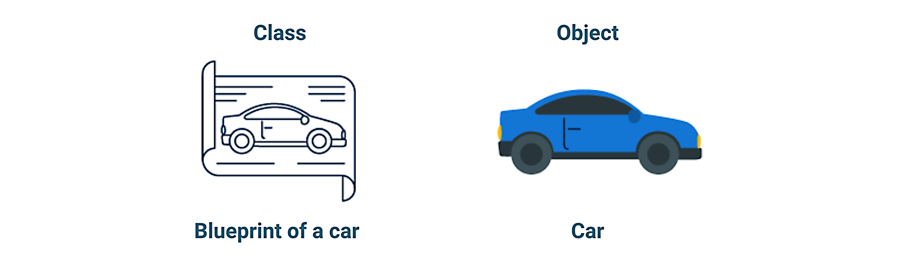
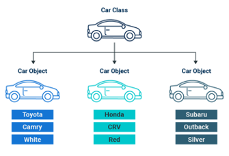

## Module 3.3: Python Classes and Object Oriented Programming

### Overview

This class will introduce the concept of object-oriented programming (OOP), a programming paradigm that uses objects and classes to structure and organize code. OOP is a fundamental aspect of Python programming and can make code more readable, reusable, and easy to maintain. By understanding and applying OOP principles, you can write more effective and efficient Python code.

### Class Objectives

By the end of today's class, the students will be able to:

* Understand the fundamental concepts of object-oriented programming.
* Understand the differences between class objects, attributes, instances, and methods.
* Write code that is reusable, modular, and readable using Python classes.
* Understand and apply inheritance in OOP.

---

### Instructor Notes

In this lesson, the students will dive into object-oriented programming (OOP) using Python. The lesson will provide the students with a basic understanding of how to use objects, classes, instances, and inheritance in OOP.

Students who are still struggling with the pace of class or the Python concepts we’re covering may find today’s class more challenging. We have given more time to instructor demonstrations and reviews for you to introduce new material and go over the solutions.

For those students who are struggling, make sure that the TAs are circulating and aiding students who need support. If class is ahead of schedule, students may have extra time for additional problems or reviews of class material.

---

### Class Slides

The slides for this lesson can be viewed on Google Drive here: [Module 3.3 Slides](https://docs.google.com/presentation/d/1ceT2MNFzQR5WOH0Sn9jfG9iLBI7nQBgtNnQQAyzEkKQ/edit?usp=sharing).

To add the slides to the student-facing repository, download the slides as a PDF by navigating to File, selecting "Download as," and then choosing "PDF document." Then, add the PDF file to your class repository along with other necessary files. You can view instructions for this [here](https://docs.google.com/document/d/1XM90c4s9XjwZHjdUlwEMcv2iXcO_yRGx5p2iLZ3BGNI/edit).

* **Note** Editing access is not available for this document. If you wish to modify the slides, create a copy by navigating to File and selecting "Make a copy...".

---

### Time Tracker

| Start Time | Number | Activity                                           | Duration |
| ---------- | ------ | -------------------------------------------------- | -------- |
| 6:30 PM    | 1      | Instructor Do: Introduction to Class               | 0:05     |
| 6:35 PM    | 2      | Instructor Do: Introduction to Object Oriented Programming | 0:20     |
| 6:55 PM    | 3      | Students Do: Modify the Car Class                  | 0:15     |
| 7:10 PM    | 4      | Review: Modify the Car Class                       | 0:05     |
| 7:15 PM    | 5      | Instructor Do: Adding Methods to Classes           | 0:15     |
| 7:30 PM    | 6      | Students Do: Add Car Class Methods                 | 0:15     |
| 7:45 PM    | 7      | Review: Add Car Class Methods                      | 0:10     |
| 7:55 PM    | 8      | Break                                              | 0:15     |
| 8:10 PM    | 9      | Instructor Do: Creating Modules from Classes       | 0:10     |
| 8:20 PM    | 10     | Students Do: Create and Import a Bank Account Module | 0:20     |
| 8:40 PM    | 11     | Review: Create and Import a Bank Account Module    | 0:10     |
| 8:50 PM    | 12     | Instructor Do: Inheritance                         | 0:15     |
| 9:05 PM    | 13     | Students Do: Account Inheritance                   | 0:15     |
| 9:20 PM    | 14     | Review: Account Inheritance                        | 0:05     |
| 9:25 PM    | 15     | End Class                                          | 0:05     |
| 9:30 PM    |        | END                                                |          |


---

### 1. Instructor Do: Introduction to Class (5 min)

Open the slideshow and use the first few slides to welcome the class. Cover the following points:

* Welcome the students, and explain that, in today’s lesson, they will learn the fundamentals of Python object-oriented programming (OOP). We'll cover objects, classes, instances, and inheritance—the core elements of OOP. By the end of this session, the students will gain valuable insights into creating modular and reusable code using OOP principles in Python.

---

### 2. Instructor Do: Introduction to Object Oriented Programming (20 min)

**Corresponding Activity:** [01-Ins_OOP_Basics](Activities/01-Ins_OOP_Basics/)

Continue using the slideshow to accompany this demonstration.

Begin by letting the students know that we have been focused on coding relatively simple problems. Now, they are going to learn to solve more complex problems by using **object-oriented programming** (OOP). OOP is centered on creating objects. You can think of an object as a wrapper for a group of related code properties and behaviors.

* Objects allow us to model things from the real-world, as well as any relationships or interactions they may have with other objects.

#### Objects in OOP

An object is a software entity that contains both data and procedures, which are defined as follows:
* The data contained in an object is known as the object’s data attributes. You can think of these as the object’s properties.
* For example, if you were creating an object to represent a car, the object’s data attributes might be its make and model.

* The procedures that an object performs are known as methods. Methods are functions that are defined inside of an object and perform operations on the object’s data attributes.
* You can think of methods as being responsible for the object’s behavior.

Emphasize that an object is a self-contained unit that consists of data attributes and methods that operate on the data attributes.

#### Python Classes

Introduce classes as follows:
* In Python, objects are defined using **classes**.
* Think of the class as the blueprint that specifies the properties and behaviors of an object.

    

* You now know that the functions (called methods) are responsible for the object’s behavior, while the attributes store its properties.
* For example, in a `Car` class, the attributes would be the make, model, and color.

    

* Emphasize that the class defines how the object will look and behave.


**Defining a Class**

Next, describe how to define a class to the students using the following:

* All class definitions start with the keyword `class`, followed by the name of the class and a colon.
* All the code in the class is indented below the class name or definition, just like when adding code to a function.

* Here is how to define a `Car` class:

    ```python
    class Car:
        < code for the class goes here >
    ```

* Point out to the students that class names in Python are written in `UpperCamelCase`, with the first letter of every word capitalized. This is a naming convention that should be followed, much like descriptive names for functions.

* Next, we can define two attributes, the `make` and the `model`, of the `Car` class as follows:

    ```python
    # Define the Car class
    class Car:
        """ Creating a Car class with attributes and instances"""
        def __init__(self, make, model):
            self.make = make
            self.model = model
    ```

Review the following parts of the `Car` class with the students:

* `Car` is the **class** itself. It serves as a blueprint for creating car objects.

* `__init__()` is a **special method called the constructor**. It is responsible for initializing the newly created car object.
   * The constructor takes three **parameters**: `self`, `make`, and `model`.

* `self.make` and `self.model` are **instance variables** that store the make and model of the car. They represent the attributes of a specific car object.

* Point out that there is a one-line docstring immediately inside the class definition. This, too, is a best practice that students learned in the previous lesson.

**The importance of the `__init__()` method**

Go over the following points and make sure that the students understand the use of the `__init()__` method.

* Whenever you create a new car object, ideally you have a specific set of attributes.

* The `__init__()`  method is responsible for assigning the *initial* state of those attributes to any car object that you create.

* If you want a user to be able to specify the make and the model of a car object instance, you set up your `__init__()` method to receive these two attributes as arguments as follows:

    * The first parameter in the `__init__()` method definition is always going to be `self`. It is a reference to the object itself. The `self` parameter in the `__init__()` method is a convention in Python that references the instance of the object being created or operated on. In this case it is the car object and its attributes.

    * The second parameter is the `make` attribute.

    * The third parameter is the `model` attribute.

    *  **Important:** Don’t forget to add the `self` parameter when defining a class! If you don’t add the seIf parameter you will get a `TypeError` that might say `: __init__() takes x positional arguments but x+1 were given`, where `x` is any integer greater than one.

Next, go over the next part of the code.

* In the example, we have created two properties, `make` and `model` that have the values `make` and `model`, which were assigned in the lines:

	```python
	self.make = make
    self.model = model
	```
* Mention to the students the significance of the period, or **dot notation**, `self.made` and `self.model` is to access and modify the attributes of an object being created.

* By using `self` in our dot notation, we are referring to the current object being defined or operated on.

* Next, wrap up this section by pointing out that the meaning of `self.make` and `self.model` as follows:

    * Each line is saying, "take whatever object is being considered and update its `make` attribute to be equal to the make of the car and its `model` attribute to be equal to the model of the car."

#### Class Instances

Emphasize the difference between a class and an instance using these talking points:

* Defining an object does not mean you’ve created one, only that you’ve sketched out the blueprint for its attributes and behaviors.

    * **Rewind** The class defines how the object will look and behave.

* When you actually create an object based on the blueprint you are creating an **instance** of that class. The instance will contain all the attributes and behaviors that you laid out in the "blueprint".

    * **Note** Although we’ve just made this distinction, it is true that, in OOP, the terms "instance" and "object" are often used interchangeably.

* To add data to the `make` and `model` parameters of the `Car` object,  we pass in data to the instance of the `Car` class created using the constructor `__init__()` method with the arguments "Toyota" and "Camry" as follows:

```python
# Create an instance of the Car class
my_car = Car("Toyota", "Camry")
```
Point out the following:

* Attributes are passed into the class much like arguments into a function, because the `__init__()` method is responsible for initializing the object.

* When we pass in "Toyota" and "Camry" to the `make` and `model` parameters, these values are assigned to the `make` and `model` attributes of the `my_car` object.

* If we want to print out the `make` and `model` of the `Car` object, we reference the attributes of the `Car` instance as follows:

    ```python
    # Print the details of the car
    print(f"Make: {my_car.make}")
    print(f"Model: {my_car.model}")
    ```
* The output is as follows:

    ```text
    Make: Toyota
    Model: Camry
    ```
Answer any questions the students might have before moving on.

---

### 3. Students Do: Modify the Car Class (15 min)

**Corresponding Activity:** [02-Stu_Modify_Car_Class](Activities/02-Stu_Modify_Car_Class/)

Continue through the slideshow, using the next slides as an accompaniment to this activity.

This activity will give students an opportunity to practice adding parameters to a class, creating class methods, and creating an instance of the class that passes parameters to the class, based on the inputs of a user.

---

### 4. Review: Modify the Car Class (5 min)

**Corresponding Activity:** [02-Stu_Modify_Car_Class](Activities/02-Stu_Modify_Car_Class/)

Open the solution, share the file with the students, and go over with the class, answering whatever questions students may have.

Cover the following key points during the discussion:

* First, we initialize the `Car` class with the our parameters and create the instances for each parameter as follows;

    ```python
    class Car:
        """Creating a Car class with 6 parameters and instances"""
        def __init__(self, make, model, body, engine, year, color):
            self.make = make
            self.model = model
            self.body = body
            self.engine = engine
            self.year = year
            self.color = color
    ```

* Next, we write six prompts for the user to define each parameter and create an instance of the `Car` class and pass in the variables from the user as follows:

    ```python
    # Prompt the user to enter the information for the car for each parameter.
    make = input("Enter the make of the car: ")
    model = input("Enter the model of the car: ")
    body = input("Enter the body type for the car: ")
    engine = input("Enter the engine type for the car: ")
    year = int(input("Enter the year the car was made: "))
    color = input("Enter the color of the car: ")

    # Create an instance of the `Car` class and pass in the variables from the user.
    car = Car(make, model, body, engine, year, color)
    ```

* Lastly, we print the details of the car.

    ```python
    print('Here is the information you enter for the car.')
    print(f"Make: {car.make}")
    print(f"Model: {car.model}")
    print(f"Body: {car.body}")
    print(f"Engine Type: {car.engine}")
    print(f"Year made: {car.year}")
    print(f"Color: {car.color}")
    ```
Answer any questions the students might have.

---

### 5. Instructor Do: Adding Methods to Classes (15 min)

**Corresponding Activity:** [03-Ins_Adding_Methods](Activities/03-Ins_Adding_Methods/)

Continue using the slideshow to accompany this demonstration.

In this activity, the students will learn how to use instance methods to define specific behaviors for objects and facilitate seamless interaction with their own data.

Point out the following benefits of using instance methods. They allow you to:

* Access and manipulate the attributes of an instance.
* Reuse the same code across multiple instances of a class.
* Encapsulate related actions together.
* Modify or extend the behavior of objects by adding or modifying new behaviors to classes.

#### Accessing Attributes of an Instance

Next, demonstrate how to create an instance method for the make of the car in the `Car` class, using the following talking points:

* The method we create will retrieve the make of the car.

* First, we define the `Car` class and initialize the class with the `make` parameter.

    ```python
    """Creating a Car class with methods and instances"""

    # Define the Car class
    class Car:
        """Creating a Car class with methods"""
        def __init__(self, make):
            self.make = make
    ```

    * **Note** Ensure that students are aware that this is different from the earlier class which had two parameters. This class only has one.

* Next, we add an instance method, which is a function that is defined within a class. This method will get the make of the car when it is called.

    ```python
    # Define the Car class
    class Car:
        """Creating a Car class with methods"""
        def __init__(self, make):
            self.make = make

            # Create a method to get the make of the car
        def get_make(self):
            """Gets the make of the car"""
            return self.make
    ```

Point out that, in general, the definition of the method does not differ from the way we defined functions before. We do the following for a method:

* Define the method with the `def` keyword.
* Choose a descriptive and short name.
* Include a docstring describing the functionality of the method.
* Specify what the function should return.
* The key difference is that we specify `self` as a parameter, which will refer to the object being operated on and is used in the body of the function.

    * **Note** As we will see later on, we don’t expect the user to provide any argument when calling this method. Still, it is essential to provide the `self` parameter to avoid errors.

* Next, ask the students, why would it be useful to have a method like this?

* **Answer** Creating a method allows you to interact with the object being created; in this case, the car object.  With methods we can perform actions. The `get_make()` method will allow us to get the make of the car which will be demonstrated below.

* Before moving on, remind the students that, up until now, we have only created the blueprint for the object and its method. Next, we create an actual instance of the `Car` class.

    ```python
    # Create an instance of the Car class.
    my_car = Car("Toyota")

    # Get the initial  make of the car.
    initial_make = my_car.get_make()
    print(f"Current Make: {initial_make}")
    ```

* Ask the students the following question: How does `my_car.get_make()` get the make of the car?

* **Answer** When the `get_make()` method is called, the data returned is the `self.make` attribute, which was initialized when we created the `Car` class. The data returned from the `self.make` attribute is the make of the car.

#### Manipulating the Attributes of an Instance

Next, go over how we can use methods to change the attribute of an instance.

Begin by mentioning that, by changing the attributes using methods, we can modify the behavior of objects.

* Since our `Car` class serves as a blueprint for creating car objects. We can create a new method, `set_make` to change the make of the car as follows:

    ```python
    """Creating a Car class with methods and instances"""
    # Define the Car class
    class Car:
        """Creating a Car class with methods"""
        def __init__(self, make):
            self.make = make

            # Create a method to get the make of the car
        def get_make(self):
            """Gets the make of the car"""
            return self.make

        # Create a method to change the make of the car
        def set_make(self, new_make):
            """Sets the make of the car"""
            self.make = new_make
    ```

* By creating the `set_make()` method we have the ability to change the make of the car when we call this method.

* Point out that we added a new parameter, `new_make` that the user will specify when they call the method. This will be assigned to the `self.make` attribute and change the make of the car.

Show the following code and mention the following:

* We create the instance of the `Car`class as we did before, and get the initial make of the car using the `get_make()` method.

* Next, we set the make of the car by passing "Honda" to the `set_make() method.  Then, we update the make of the car by assigning the `my_car.get_make()` method to the `updated_make` variable:

    ```python
    # Create an instance of the Car class.
    my_car = Car("Toyota")

    # Get the initial make of the car.
    initial_make = my_car.get_make()
    print(f"Current Make: {initial_make}")

    # Set a new make.
    my_car.set_make("Honda")

    # Get the updated make.
    updated_make = my_car.get_make()
    print(f"Updated Make: {updated_make}")
    ```

* The output will be the initial make and the updated make of the car.

    ```text
    Initial Make: Toyota
    Updated Make: Honda
    ```

* Before moving on, emphasize that methods with `get` in them are referred to as "getter" methods, and methods with `set` in them are referred to as "setter" methods.

---

### 6. Students Do: Add Car Class Methods  (15 min)

**Corresponding Activity:** [04-Stu_Add_Methods_Car_Class](Activities/04-Stu_Add_Methods_Car_Class/)

Continue through the slideshow, using the next slides as an accompaniment to this activity.

This activity will allow students to practice creating class methods to modify an instance of the `Car` class by prompting the user for the required information.

---

### 7. Review: Add Car Class Methods (10 min)

**Corresponding Activity:** [04-Stu_Add_Methods_Car_Class](Activities/04-Stu_Add_Methods_Car_Class/)

Open the solution, share the file with the students, and go over with the class, answering whatever questions students may have.

Cover the following key points during the discussion:

* The students can create any three setter methods of their choosing. Ask the students which setter methods they created and how they set them up. Then, go over some of the setter methods in the solution.

* Next, the students were instructed to create three new prompts to ask the user to change three of the car’s attributes.

    ```python
    # Prompt the user to change three attributes of the car.
    model = input("What Subaru model would you like? ")
    year = int(input("What model year are you looking for? "))
    color = input("What color would you like? ")
    ```
* Then, the updated information about the car is passed to the setter methods.

    ```python
    # Pass the updated car information from the user to the setter method you created above.
    car.set_model(model)
    car.set_year(year)
    car.set_color(color)
    ```

* Finally, point out that, once we change the attributes, we can print out the updated information using the getter methods as before.

Answer any questions before moving on.

---

### 8. Break (15 min)

---

### 9. Instructor Do: Creating Modules from Classes (10 min)


**Corresponding Activity:** [05-Ins_Creating_Modules](Activities/05-Ins-Creating_Modules/)

Continue using the slideshow to accompany this demonstration.

Begin by mentioning that, up to this point in today’s class, we have been writing programs within the defined class statement, which is fine for small programs that use a few classes, but as you use more classes it is good practice to organize those classes into modules.

In this activity, we will focus on storing classes as modules.

* Emphasize that, by storing the classes in modules, you are able to practice better programming by promoting better code organization, encapsulation, and reusability.  All in all, this allows for more manageable and modular code.

Begin by opening the solution from the previous activity.

* First, we will remove all the code from where we created the instance of the `Car` class to the end and save it to a new file called, `car_data.py`.

* Then, save the code that has the `Car` class as `Car.py` in the same folder as the `car_data.py` file.

Here is the code in the `car_data.py` file:

```python
# Create an instance of the Car class.
car = Car("Subaru", "CrossTrek Limited", "SUV", "2.5L, 4 cylinder","2020", "Pearl Blue")

# Get the current car information using the getter methods.
print('Here are the details of the car.')
print(f"Make: {car.get_make()}")
print(f"Model: {car.get_model()}")
print(f"Body: {car.get_body()}")
print(f"Engine Type: {car.get_engine()}")
print(f"Year made: {car.get_year()}")
print(f"Color: {car.get_color()}")

# Prompt the user to change three parameters for the car.
model = input("What Subaru model would you like? ")
year = int(input("What model year are you looking for? "))
color = input("What color would you like? ")

# Use the setter methods to change the information using the user’s input.
car.set_model(model)
car.set_year(year)
car.set_color(color)

# Print the new details about the car.
print('Here are the updated details of the car.')
print(f"Make: {car.get_make()}")
print(f"Model: {car.get_model()}")
print(f"Body: {car.get_body()}")
print(f"Engine Type: {car.get_engine()}")
print(f"Year made: {car.get_year()}")
```

Next, show the students how to import the `Car` class from the `Car.py` file.

* At the top of the `car_data.py` file, tell them to add the following code:

    ```python
    # Import the Car class from the car_data.py file.
    from Car import Car
    ```

* Point out that, when importing a class or a function from another Python file, we don’t need to use the file extension, `.py`.

* Next, have the students run the `car_data.py` file. The output should show the default car information. Then, prompt the user to enter the new information to update the car data.

    ```text
    Here are the details of the car.
    Make: Subaru
    Model: CrossTrek Limited
    Body: SUV
    Engine Type: 2.5L, 4 cylinder
    Year made: 2020
    Color: Pearl Blue
    What Subaru model would you like? Outback Limited
    What model year are you looking for? 2021
    What color would you like? Silver
    Here are the updated details of the car.
    Make: Subaru
    Model: Outback Limited
    Body: SUV
    Engine Type: 2.5L, 4 cylinder
    Year made: 2021
    Color: Silver
    ```

Answer any questions before moving on.

---

### 10. Students Do: Create and Import a Bank Account Module (20 min)

**Corresponding Activity:** [06-Stu_Bank_Account_Class](Activities/06-Stu_Bank_Account_Class/)

Continue through the slideshow, using the next slides as an accompaniment to this activity.

This activity will give students hands-on experience in creating and using Python classes. They'll learn how to define a class, add methods, import it into a new file, and use its methods to interact with user input. This mirrors real-world scenarios where developers often need to create reusable code (modules) and use them across different parts of a software project.

Open up the `BankAccount` class and show the students the attributes and methods that they’ll be using and accessing.

Point out the following about the `deposit` and `withdraw` methods:

* The  `deposit` method returns the amount deposited plus the starting balance.
* The `withdraw` method checks to make sure that the balance is greater than or equal to the amount to be withdrawn. If it is, then the amount to be withdrawn is subtracted from the balance. If it isn’t, then the user will get a notification that there is insufficient funds.

---

### 11. Review: Create and Import a Bank Account Module (10 min)

**Corresponding Activity:** [06-Stu_Bank_Account_Class](Activities/06-Stu_Bank_Account_Class/)

Open the solution, share the file with the students, and go over with the class, answering whatever questions students may have.

Cover the following key points during the discussion:

* First, the students should have imported the `BankAccount` class from the BankAccount.py` file. Next, they should have created an instance of the `BankAccount` class that sets the user’s starting balance with a prompt.

    ```python
    # Import the BankAccount class from the BankAccount file.
    from BankAccount import BankAccount

    # Prompt the user to set the starting balance.
    starting_balance = float(input('Enter your starting balance: '))

    # Create an instance of the `BankAccount` class that sets the users starting balance.
    savings = BankAccount(starting_balance)
    ```

* Then, the user’s weekly pay should be passed to the deposit method of the `BankAccount` class, and the updated balance is displayed.

    ```python
    # Prompt the user to deposit their paycheck.
    pay = float(input('How much were you paid this week? '))
    print('I will deposit $', format(pay, ',.2f'),'into your account.')

    # Pass the users pay to the deposit method using the instance of the BankAccount class.
    savings.deposit(pay)

    # Display the balance and format the amount to two decimal places and thousandths.
    print('Your account balance is $', format(savings.get_balance(), ',.2f'))
    ```

* Take a moment to check the students' understanding by going over the following:

    * When we pass the amount to be deposited to the `deposit` method, the balance will be increased by the specified amount to be deposited.  And, when we use the `get_balance` method in the print statement, the new balance will be displayed.

* Lastly, the students should have passed the user’s amount to be withdrawn to the `withdraw` method using an  instance of the `BankAccount` class and then display the new balance after the withdrawal.

    ```python
    # Prompt the user to withdraw an amount.
    cash = float(input('How much would you like to withdraw? '))
    print('I will withdraw $', format(cash, ',.2f'),'from your account.')

    # Pass the user’s desired withdrawal amount to the withdraw method using the instance of the BankAccount class.
    savings.withdraw(cash)

    # Display the balance and format the amount to two decimal places and thousandths.
    print('Your account balance is $', format(savings.get_balance(), ',.2f'))
    ```

* Check the students' understanding of how the `withdraw` method in the `BankAccount` class updates the balance.

Answer any questions before moving on.

---

### 12. Instructor Do: Inheritance (15 min)

**Corresponding Activity:** [07-Ins_Inheritance](Activities/07-Ins_Inheritance/)

Continue using the slideshow to accompany this demonstration.

For the last activity, the students will learn how to use inheritance when using multiple classes.

#### What is inheritance and when and why should we use it?

Introduce students to the idea of inheritance in Python as follows:

* Say we wanted to create objects that have the same attributes and behaviors as defined by our `Car` class but with a few added extras. How could we do that efficiently?

* Of course, we could just create a new class and copy and paste all of the code from the `Car` class into it. But this brute force approach goes against the DRY best practices.

* Remind the students that the using functions and classes allows for modularity and code reuse, without the developer doing more work.

* The solution for our scenario is to use **inheritance**.

* Inheritance is when we create a new class based on an existing class.

* The new class is called either a **subclass** or **child class**, and the existing class is called either a **base class**, **superclass**, or the **parent class**.

* The subclass is a specialized version of the base class and uses the same attributes and methods as the base class.

* When you create a subclass it will **inherit** all the attributes and methods from the original base class. The subclass, however, may have other methods defined inside it that give it special functionality.

    * **Rewind** Recall that one of the reasons for using OOP is that it models real-world objects and the relationships between them quite well. The parent-child classification of objects in Python is a major contributor to how OOP models real-world objects and relationships.

Consider our `Car` class as an example.

* In the real-world, you have cars of a certain make, model, body, engine, year, and color. And then subcategories of those same cars exist that have optional extras such as anti-theft, alarm, tinted windows, and an extended warranty. Let’s model this using our earlier code with only the "getter" methods in the `Car` class.

#### Creating a subclass

Open up the `CarData.py` file and show the students the `Car` class and let them know that this class is our parent class.

```python
""" Creating a Car class with methods and instances"""

# Define the Car class.
class Car:
    """Creating a Car class with methods"""
    def __init__(self, make, model, body, engine, year, color):
        self.make = make
        self.model = model
        self.body = body
        self.engine = engine
        self.year = year
        self.color = color

    # Create a method to get the make of the car.
    def get_make(self):
        """Returns the make of the car"""
        return self.make

    # Create a method to get the model of the car.
    def get_model(self):
       """Returns the model of the car"""
       return self.model

    # Create a method to get the body of the car.
    def get_body(self):
        """Returns the body of the car"""
        return self.body

    # Create a method to get the engine of the car.
    def get_engine(self):
       """Returns the engine of the car"""
       return self.engine

    # Create a method to get the year of the car.
    def get_year(self):
        """Returns the year of the car"""
        return self.year

    # Create a method to get the color of the car.
    def get_color(self):
       """Returns the color of the car"""
       return self.color
```

* Next, we’ll add a second class called, `CarExtras` that imports all the arguments of the `Car` class. The `CarExtras` class is our child class.

    ```python
    # Define the CarExtras class
    class CarExtras(Car):
    ```

* Point out that we added the `Car` class as a parameter for the `CarExtras` class, which means the `CarExtras` class inherits all the attributes and methods of the `Car` class.

* Mention that providing the `Car` class as a parameter when defining the `CarExtras` class is what indicates that all instances of the `CarExtras` object will be child instances of the `Car` class. However, passing it in as a parameter this way doesn’t automatically mean that the child class has knowledge of the parent class’s attributes and methods.

* For the child class to have knowledge of the parent class’s attributes and methods, we have to "inform" the child class of the attributes and methods it will inherit by adding the `__init__` method and passing in the required parameters from the `Car` class, then adding any new parameters for the `CarExtras` class as follows:

    ```python
    # Define the CarExtras class that inherits the attributes from the Car class.
    class CarExtras(Car):
        """Creating a CarExtras class with methods"""
        def __init__(self, make, model, body, engine, year, color, anti_theft, alarm, tint, ext_warranty):
    ```

* Point out that we have added all the parameters of the `Car` class and have created four new parameters, `anti_theft`, `alarm`, `tint`, and `ext_warranty`.

* Next, we need to make sure that the `CarExtras` class has access to the attributes and methods of the `Car` class so we need to call the `Car` class `__init__()` method with the parameters from the `Car` class as follows:


    ```python
    # Define the CarExtras class that inherits the attributes from the `Car` class.
    class CarExtras(Car):
        """Creating a CarExtras class with methods"""
        def __init__(self, make, model, body, engine, year, color, anti_theft, alarm, tint, ext_warranty):
            # Call the parent class's __init__ method and pass the required arguments.
            Car.__init__(self, make, model, body, engine, year, color)
    ```

* Then, we initialize the attributes and add the methods for the CarExtras. As before, we will add methods that retrieve information about the anti-theft, alarm, tint, and extended warranty attributes of the `CarExtras` object.

    ```python
    # Define the CarExtras class that inherits the attributes from the Car class.
    class CarExtras(Car):
        """Creating a CarExtras class with methods"""
        def __init__(self, make, model, body, engine, year, color, anti_theft, alarm, tint, ext_warranty):
            # Call the parent class's __init__ method and pass the required arguments.
            Car.__init__(self, make, model, body, engine, year, color)

            # Initialize the attributes for the CarExtras class.
            self.anti_theft = anti_theft
            self.alarm = alarm
            self.tint = tint
            self.ext_warranty = ext_warranty

    def get_anti_theft(self):
            """Sets the antitheft for the car"""
            return self.anti_theft

        def get_alarm(self):
            """Sets the alarm for the car"""
            return self.alarm

        def get_tint(self):
            """Sets the tint for the car"""
            return self.tint

        def get_ext_warranty(self):
            """Sets the extended warranty for the car"""
            return self.ext_warranty
    ```

Ask students the following:

* Why did we not include methods to retrieve the make, model, body, engine, year, or color of the car?

* **Answer** Those methods are already included in the parent class and are inherited by the `CarExtras` child class, which means that, even though there is no `get_make()` method explicitly defined in the `CarExtras` class, it is still able to perform the `get_make()` functionality that it inherited. The same can be said for why we don’t initialize the attributes that are inherited from the parent class.

Continue with the demonstration:

* Next, open up the `car_extras_solution.py` file and show the student that we create an instance of the `CarExtra` class and pass in the arguments for the `Car` class and the arguments for the `CarExtra` class ("Yes", "Yes", "No", "No"), then print the updated car information as follows:

    ```python
    # Create an instance of the CarExtras class.
    my_car = CarExtras("Toyota", "Camry", "Sedan", "2.5L", 2022, "Silver", "Yes", "Yes", "No", "No")

    # Get the updated details of the car.
    print('Here are the details of the car.')
    print(f"Make: {my_car.get_make()}")
    print(f"Model: {my_car.get_model()}")
    print(f"Body: {my_car.get_body()}")
    print(f"Engine Type: {my_car.get_engine()}")
    print(f"Year made: {my_car.get_year()}")
    print(f"Color: {my_car.get_color()}")
    print(f"Anti-Theft: {my_car.get_anti_theft()}")
    print(f"Alarm: {my_car.get_alarm()}")
    print(f"Tint: {my_car.get_tint()}")
    print(f"Extended Warranty: {my_car.get_ext_warranty()}")
    ```

* When we run the code we get the following:

    ```text
    Here are the details of the car.
    Make: Toyota
    Model: Camry
    Body: Sedan
    Engine Type: 2.5L
    Year made: 2022
    Color: Silver
    Anti-Theft: Yes
    Alarm: Yes
    Tint: No
    Extended Warranty: No
    ```

Answer any questions before moving on.

---

### 13. Students Do: Account Inheritance (15 min)

**Corresponding Activity:** [08-Stu_Account_Inheritance](Activities/08-Stu_Account_Inheritance/)

Continue through the slideshow, using the next slides as an accompaniment to this activity.

In this activity, we will simulate a basic banking system by creating two classes: `SavingsAccount` and a certificate of deposit,  `CD`. The `SavingsAccount` class will be our parent class, with attributes for balance and interest rate. The `CD` class will be the child class inheriting from the `SavingsAccount` class, with an additional attribute for the length of time of the CD.

> **Note** A certificate of deposit (CD) is a savings account that often pays a higher interest rate compared to a savings deposit account. A CD earns interest at a fixed rate over a set period of time known as the term.

Open up the [Accounts.py](Activities/08-Stu_Account_Inheritance/Unsolved/Accounts.py)
 file in the unsolved folder and show the students the `SavingsAccount` and `CD` classes.

* Point out that the students will have to add parameters to the `__init__()` method for the `SavingsAccount`  and `CD` classes, and create the attributes for the methods they’ll be accessing and using.

Next, open up the [account_inheritance.py](Activities/08-Stu_Account_Inheritance/Unsolved/account_inheritance.py) file and go over the following:

* Let the students know that they’ll be writing the prompts to get the savings account and CD account balances and interest rates, and the length of months for the CD account.

* Then, they’ll create `SavingsAccount` and `CD` accounts instances to pass the data from the user to the class methods, and print out the details of the savings and CD accounts.

Next, run the [account_inheritance_solution.py](Activities/08-Stu_Account_Inheritance/Solved/account_inheritance_solution.py) file to show the students what a typical output would look like.

```text
What is your savings account balance? 2789.21
What is the APR for the savings account? 0.5
What is your initial CD account balance? 12500
What is the APR for the CD account? 2.5
What is the length of months for your CD? 12
Here are the details of the savings account.
The balance is: $ 2,789.21
APR Interest Rate is:  0.50 %
Here are the details of the CD account.
The balance is: $ 12,500.00
APR Interest Rate is: 2.50 %
Length of CD is: 12 months.
```

Answer any questions the students may have.

---

### 14. Review: Account Inheritance (5 min)

**Corresponding Activity:** [08-Stu_Account_Inheritance](Activities/08-Stu_Account_Inheritance/)

Open the solution, share the file with the students, and go over with the class, answering whatever questions students may have.

Cover the following key points during the discussion:

* The parameters for the for the `SavingsAccount` class are, `self`, `balance`, `int_rate` and the attributes are as follows:

```python
class SavingsAccount:
    """Creating a Savings Account class with methods"""
    def __init__(self, balance, int_rate):
        self.balance = balance
        self.int_rate = int_rate
```

* The `get_balance` and the `get_interest` methods will return the attribute for the balance and interest rate, respectively:

```python
    # This method gets the balance of the savings account.
    def get_balance(self):
        """Gets the balance for the savings account"""
        return self.balance

    # This method gets the interest rate of the savings account.
    def get_interest(self):
        """Gets the interest rate for the savings account"""
        return self.int_rate
```

* The parameters for the for the `CD` class are, `self`, `balance`, `int_rate` and `months`, and we call the `SavingsAccount` class’ `__init__()` method and pass in the `self`, `balance`, and `int_rate` parameters. The new attribute we add is `self.months = months`.

    ```python
    class CD(SavingsAccount):
        """Creating a CD Account class with methods"""
        def __init__(self, balance, int_rate, months):
        # Call the parent class's __init__ method and pass the required arguments
            SavingsAccount.__init__(self, balance, int_rate)
            self.months = months
    ```

* The `get_months` method will return the `self.months` attribute.

    ```python
        # This method gets the length of months for the CD.
        def get_months(self):
            """Gets the length of the CD"""
            return self.months
    ```

* In the `account_inheritance.py` file we import the both classes from the `Accounts.py` file.

    ```python
    from Accounts import SavingsAccount, CD
    ```

* The savings and CD account data from the user prompts are passed to instances of the `SavingsAccount` class and `CD` class, respectively.

    ```python
    # Create an instance of the `SavingsAccount` class that sets the users savings account balance and interest.
    savings_data = SavingsAccount(savings_balance, savings_interest)

    # Create an instance of the `CD` class that sets the users cd account balance, interest, and length of months.
    cd_data = CD(cd_balance, cd_interest, cd_maturity)
    ```
* The students may have different variables but the principle is the same.

Make sure the students get the desired output. If not, troubleshoot any issues.

---

### 15. End Class (5 min)

Congratulate the students on reaching the end of final day for Module 3!

Today we've learned how inheritance allows us to create new classes that can take on attributes and methods from existing classes, allowing for code reuse and a more efficient design. We've also explored the impact of selectively importing classes and seen how this can affect our code execution.

Mention that students are now able to:
* Understand the fundamental concepts of object-oriented programming.
* Understand the differences between class objects, attributes, instances, and methods.
* Write code that is reusable, modular, and readable using Python classes.
* Understand and apply inheritance in OOP.

Everything we’ve learned today and in the past two days will help you solve complex coding problems more efficiently, no matter how many moving parts the solution entails. Now that you have mastered advanced Python programming constructs like writing functions, classes, and object-oriented principles, it’s time to explore how these skills can be applied in service of the ultimate goal of this course: coding for AI.

One of the fundamental components of AI systems is data. As you will see, working with data in AI means working with incredibly large, complicated data sets. So being able to import, explore, transform, and summarize data are non-negotiable skills. In the next module, you will be introduced to a Python library called Pandas that will allow you to easily analyze datasets.

---

© 2023 edX Boot Camps LLC. Confidential and Proprietary. All Rights Reserved.
