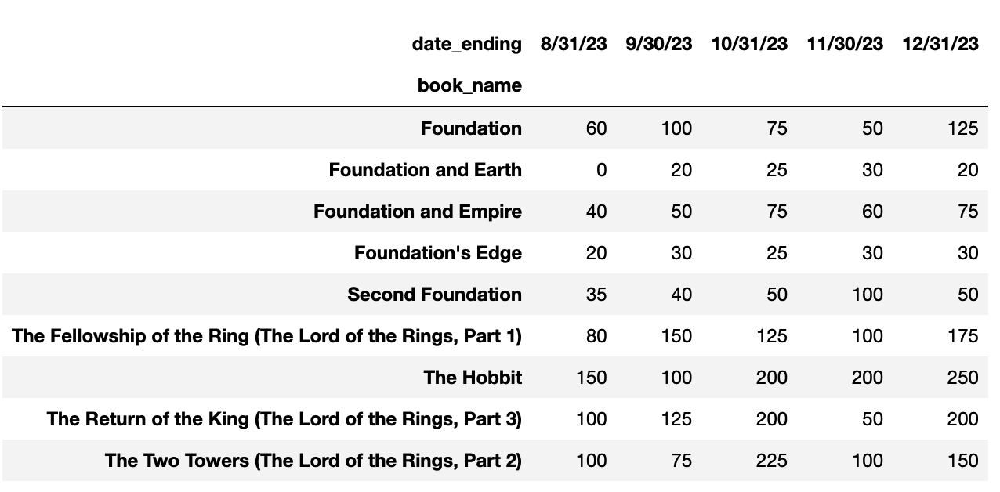
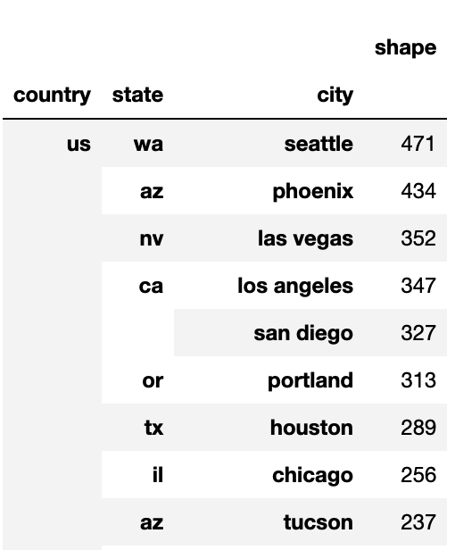
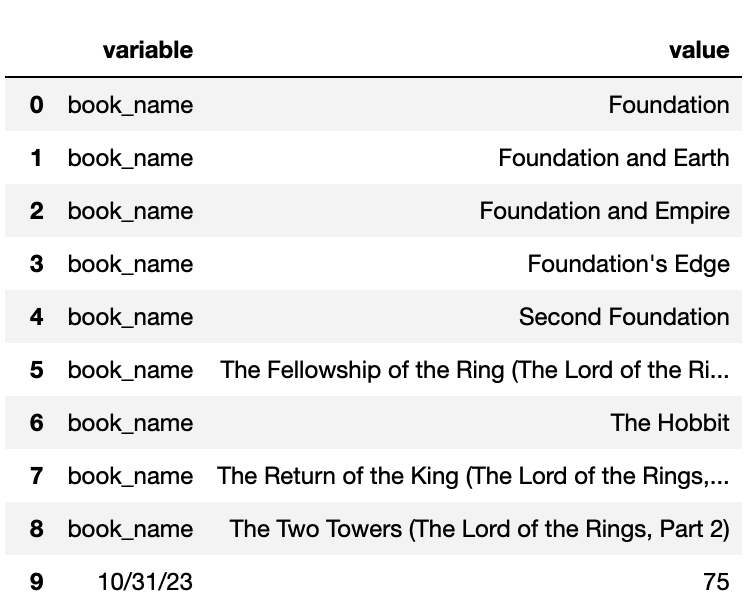

## Module 5.3:  Advanced Data Reshaping with Pandas

### Overview

In this class, students will delve into advanced data reshaping techniques using pandas. From understanding the nuances of pivoting data to effectively applying the agg() function, students will gain hands-on experience of refining their data for in-depth analysis.


### Class Objectives

By the end of today's class, the students will be able to:

* Understand the concept of pivoting data and explain its role in data analysis.
* Differentiate between single and multiple aggregations when reshaping data.
* Apply one or more aggregation functions to reshaped data.
* Use the `aggfunc` function effectively to perform various aggregations on reshaped data.
* Use custom Python functions to transform reshaped data.
* Reshape data into multi-index and apply aggregations.
* Reshape data using resample and melt.

---

### Instructor Notes

Today’s lesson will teach students about the concept of pivoting data and how pivoting can assist in data analysis. Students will also learn how to reshape data, which involves the transformation of data from one format to another, to assist in the data analysis process. They will learn to differentiate between single and multiple aggregations when reshaping data, using the `aggfunc` and custom Python functions to perform aggregations on reshaped data. Students will also learn about reshaping data using resample and melt functions.

Ensure you check for understanding frequently, as some students may still be struggling with the pace of class or working with Pandas’ methods and functions. Make sure TAs are actively circulating and assisting students who need support. If the class is ahead of schedule, consider allocating extra time for additional problems or a review of class material.

---

### Class Slides

The slides for this lesson can be viewed on Google Drive here: [Module 5.3 Slides](https://docs.google.com/presentation/d/1YyEpP7ERm3w7dMIIKNb1-2dN1J6Gt2Aj8CH168oVte4/edit?usp=sharing).

To add the slides to the student-facing repository, download the slides as a PDF by navigating to File, selecting "Download as," and then choosing "PDF document." Then, add the PDF file to your class repository along with other necessary files. You can view instructions for this [here](https://docs.google.com/document/d/1XM90c4s9XjwZHjdUlwEMcv2iXcO_yRGx5p2iLZ3BGNI/edit).

**Note:** Editing access is not available for this document. If you wish to modify the slides, create a copy by navigating to File and selecting "Make a copy...".

---

### Time Tracker

| Start Time | Number | Activity                                           | Duration |
| ---------- | ------ | -------------------------------------------------- | -------- |
| 6:30 PM    | 1      | Instructor Do: Introduction to the Class           | 0:05     |
| 6:35 PM    | 2      | Instructor Do: Pivoting                            | 0:15     |
| 6:50 PM    | 3      | Students Do: Pivoting Student Exam Scores          | 0:15     |
| 7:05 PM    | 4      | Review: Pivoting Student Exam Scores               | 0:10     |
| 7:15 PM    | 5      | Instructor Do: Pivoting with Multi-Index and Multi-Aggregations | 0:15     |
| 7:30 PM    | 6      | Students Do: Pivoting with Multi-Index and Multi-Aggregations on Car Sales | 0:15     |
| 7:45 PM    | 7      | Review: Pivoting with Multi-Index and Multi-Aggregations on Car Sales | 0:10     |
| 7:55 PM    | 8      | BREAK                                              | 0:15     |
| 8:10 PM    | 9      | Instructor Do: Pivoting with Custom Aggregations   | 0:15     |
| 8:25 PM    | 10     | Students Do: Custom Aggregations Pivoting Delayed Flights | 0:15     |
| 8:40 PM    | 11     | Review: Custom Aggregations Pivoting Delayed Flights | 0:10     |
| 8:50 PM    | 12     | Instructor Do: Reshaping Data with Resample and Melt | 0:10     |
| 9:00 PM    | 13     | Students Do: Resampling and Melting DataFrames     | 0:15     |
| 9:15 PM    | 14     | Review: Resampling and Melting DataFrames          | 0:10     |
| 9:25 PM    | 15     | End Class                                          | 0:05     |
| 9:30 PM    |        | END                                                |          |


---

### 1. Instructor Do: Introduction to the Class (5 min)

Open the slideshow and welcome the class.

* Welcome students and let them know that they’ll be learning how to reshape data, in particular DataFrames, using pivot tables.  First, they’ll learn how to create pivot tables using the `pivot` and `pivot_table` functions. They will also learn to create pivot tables on one or multiple columns, and perform one or multiple aggregations using the `pivot_table` `aggfunc()` function, and custom aggregations. Finally, they’ll learn how to reshape data using `resample` and `melt` functions.


By the end of the lesson students will be able to:

* Understand the concept of pivoting data and explain its role in data analysis.
* Differentiate between single and multiple aggregations when reshaping data.
* Apply one or more aggregation functions to reshaped data.
* Use the `aggfunc` function effectively to perform various aggregations on reshaped data.
* Use custom Python functions to transform reshaped data.
* Reshape data into multi-index and apply aggregations.
* Reshape data using resample and melt.

---

### 2. Instructor Do: Pivoting (15 min)

Use the slideshow to accompany this demonstration.

Begin by mentioning that another powerful tool to extract summary data from large, detailed, and consistent datasets is the **pivot table**.

* Explain that pivot tables summarize data using aggregation functions on subsets of the data. These subsets can be as general or as specific as we like.

* Reshaping data may reveal insights and make data more presentable to the analyst.

* Pivot tables allow the aggregation and summarization of data based on your specific requirements, providing the potential for a high-level overview of the data at a glance. The use of pandas’ `pivot` and `pivot_table` functions can assist in finding patterns within datasets that may not be easily detected using just the raw data.

  * Caution students that pivot tables are not designed for deeper analysis. They are designed to provide summary metrics at a glance.

**Corresponding Activity:** [01-Ins_Pivoting](Activities/01-Ins_Pivoting/)

* Open [pivot_book_sales_solution.ipynb](Activities/01-Ins_Pivoting/Solved/pivot_book_sales_solution.ipynb) in Jupyter Notebook and run through the code with the class, explaining the differences between using the `pivot()` and `pivot_table()` functions. Encourage students to ask questions and provide input as you progress.

 * Read in the CSV file and show the students the DataFrame.

    

* Go over the DataFrame with the students. The columns are “book_name”, “date_ending”, and “total_sales”, and the “book_name” is repeated for each “date_ending” column.

* Next, show the unique values from the “book_name” and “date_ending” columns.

```python
# Show the unique values in the book_name column.
book_sales_df["book_name"].unique()

# Show the unique values in the date_ending column.
book_sales_df["date_ending"].unique()
```

* There are nine unique values in the “book_name” column:

    

* And there are five unique values in the “date_ending” column:

    


#### Using the `pivot()` Function

Begin this section by letting the students know that we are going to create a table where the name of the book is the index and the dates are columns.

* Let the students know that we want to reshape the data so the indexes are the book names, the dates are the columns, and the total sales for each book are the column values.

    * Show the students the parameters of the `pivot` function:
    * `pd.pivot(data, columns, index=<a column>, values=<a column>`,
 or `df.pivot(columns, index=<a column>, values=<a column>`

* Using the `pivot` function, we assign the columns we want for the `columns`,  `index`, and `values` parameters as follows:

    ```python
    #  Pivot on the "date_ending" with the "book_name" as the index, and pass the "total_sales" as the values.
    pivot_books_short_form = pd.pivot(book_sales_df, columns="date_ending", index="book_name", values="total_sales" )

    # Show the table.
    pivot_books_short_form
    ```

    

 * Point out that the dates are not in chronological order.

     * Ask the students how they would reorder the **columns** in chronological order.

   *  **Answer:** We can use the `iloc` method on the DataFrame and reorder the columns numerically using the column indices as follows:

        ```python
        # Reorder columns.
        pivot_date_short_form.iloc[:,[3,4,0,1,2]]
        ```


        

* Next, we want to reshape the data so the indexes are the dates, the columns are the book names, and the total sales for each book are the column values.

    ```python
    #  Pivot on the book_name with the date_ending as the index, and pass the "total_sales" as the values.
    pivot_books_long_form = pd.pivot(book_sales_df, columns="book_name",index="date_ending",values="total_sales" )
    pivot_books_long_form
    ```


    

* Point out that the dates in the index are not in any type of chronological order.

     * Ask the students how they would reorder the **index** in chronological order.

    	 * **Note:** In a previous step, the **columns** were not in chronological order, not the index.)

   *  **Answer:** We use the `reindex` method on the DataFrame and pass in the reorder indices in a list as follows:

    ```python
    # Reindex in monthly ascending order.
    pivot_books_long_form.reindex(['8/31/23', '9/30/23','10/31/23', '11/30/23', '12/31/23'])
    ```

    


#### Using the `pivot_table()` Function

The pivot_table()` function provides an alternative way of reshaping data. It provides more versatility than using the `pivot()` function.

* Mention that in addition to setting the `values`, `columns`, and `index` parameters, the pivot_table()` function can drop null values, sort values, and can be used with the aggregations.

    * Show the students the parameters of the `pivot_table()` function:
    * `pd.pivot_table(data, values=None, index=None, columns=None, aggfunc='mean', fill_value=None, margins=False, dropna=True, margins_name='All', observed=False, sort=True)`

Using the `pivot_table()` function on our book sales DataFrame, we can show the total book sales for each book as follows:

```python
# Using the `pivot_table()` function, get the total book sales for each book.
pivot_table_books_sum = pd.pivot_table(book_sales_df,
                                       values='total_sales',
                                       columns='book_name',
                                       aggfunc='sum')

# Show the table.
pivot_table_books_sum
```


* Point out that the aggregation function parameter for the `pivot_table()` function is `aggfunc`. Remind students not to get it confused with the aggregation function parameter for the `groupby()` function, `agg()`.


#### Multiple Aggregations with Pivot Tables

To apply multiple aggregations to pivot tables we provide the aggregations as tuples as follows:

```python
# Get the total and average book sales for each book.
# Make the books the columns, and the mean and sum of the total sales under each book.
avg_sum_books = pd.pivot_table(book_sales_df,
                               values='total_sales',
                               columns='book_name',
                               aggfunc=('sum', 'mean'))

# Show the table.
avg_sum_books
```


Next, demonstrate how to reshape the table to show the total and average sales by the “date_ending” column:

```python
# Using the pivot_table function, get the average and the total of the book sales
# for each date. Make the date the index and round to one decimal place.
date_ending_pivot_table = book_sales_df.pivot_table(index="date_ending",
                                             values="total_sales",
                                            aggfunc=('mean','sum')).round(1)

# Show the table.
date_ending_pivot_table
```


* Point out that the index is not in any type of chronological order.

     * Ask the students how they would reorder the index in chronological order.

   *  **Answer:** We use the `reindex` method on the DataFrame and pass in the reorder indices in a list.


Answer any questions before moving on to the student activity.

---

### 3.  Students Do: Pivoting Student Exam Scores (15 min)


**Corresponding Activity:**[02-Stu_Pivoting_Exam_Scores](Activities/02-Stu_Pivoting_Exam_Scores/)

In this exercise, students will use the `pivot_table()` function on a DataFrame to reshape exam score data.

After answering any questions that students have about the activity, send out the instructions.

Open the slideshow, and use the next slides as an accompaniment to the activity.


---

### 4. Review: Pivoting Student Exam Scores (10 min)

**Corresponding Activity:** [02-Stu_Pivoting_Exam_Scores](Activities/02-Stu_Pivoting_Exam_Scores/)

* To encourage participation, you can open the solution and walk students through the steps required.

* After reading in the data, we reshape `exam_scores_df` DataFrame to display the average exam score for each subject.

    ```python
    # Using the `pivot_table()` function, show the average exam score for each subject.
    # The subject should be the columns. Round to one decimal place.
    avg_exam_scores = pd.pivot_table(exam_scores_df,
                                    values='exam_score',
                                    columns='subject',
                                    aggfunc='mean')

    # Rename the index "Avg_Subject_Score" and round to one decimal place.
    avg_exam_scores.rename(index={'exam_score': 'Avg. Subject Score'}).round(1)
    ```

* The pivot table should look like this:

    |  subject | Biology | Composition | Math | Speech |
    | ------- | ------ | ------- | ------- | ------- |
    |Avg. Subject Score  | 81.6  | 82.5  | 82.0  | 86.0  |


* Next, we use the same pivot table as before, but assign the `aggfunc` to the  ('min','max') tuple to show the minimum and maximum score for each subject.

    ```python
    # Using the `pivot_table()` function, show the minimum and maximum score for each subject.
    max_min_exam_scores = pd.pivot_table(exam_scores_df,
                                    values='exam_score',
                                    columns='subject',
                                    aggfunc=('min','max'))

    # Show the table.
    max_min_exam_scores
    ```

* The pivot table should look like this:

    |  subject | Biology | Composition | Math | Speech |
    | ------- | ------ | ------- | ------- | ------- |
    | max  | 96  | 96  | 94  | 97 |
    | min  | 69  | 69  | 70  | 73  |


* To show the minimum and maximum scores for each student, we swap out “student_name” for “'subject' in the previous pivot table.

    ```python
    # Use the `pivot_table()` function to get the minimum and maximum exam score for each student across all subjects.
    min_max_student_scores = pd.pivot_table(exam_scores_df,
                                    values='exam_score',
                                    columns='student_name',
                                    aggfunc=('min','max'))

    # Rename the index "Avg. Student Score".
    min_max_student_scores
    ```


    

* Lastly, to show each student's exam score for each subject, we set the `index` to “subject”, `columns` to “student_name”, and `values` to “exam_score”.

    ```python
    # Using the `pivot_table` or the `pivot` function, show each student’s exam score for each subject.
    # The student names are the columns, the subject is the index, and the values are the exam scores.
    exam_scores_subject = exam_scores_df.pivot_table(index="subject",
                                                    columns="student_name",
                                                    values="exam_score")
    exam_scores_subject
    ```

    

Answer any questions before moving on.

---

### 5. Instructor Do: Pivoting with Multi-Index and Multi-Aggregations (15 min)


**Corresponding Activity:** [03-Ins_MultiIndex_Pivoting](Activities/03-Ins_MultiIndex_Pivoting/)

Continue using the slideshow to accompany this demonstration.

In this activity, you’ll demonstrate to the students how to reshape data on multiple columns and apply multiple aggregations.

Open [03-Ins_MultiIndex_Pivoting](Activities/03-Ins_MultiIndex_Pivoting/Solved/multi_indexing_pivoting_solution.ipynb) in Jupyter Notebook and run through the code with the class.

* Review how to reshape data on a single index with one aggregation using the `pivot_table` function:

    ```python
    # Show the average seconds for each country.
    ufo_country_avg_secs = pd.pivot_table(converted_ufo_df,
                                columns='country',
                                values='duration (seconds)',
                                aggfunc='mean').round(1)

    # Rename the index.
    ufo_country_avg_secs.rename(index={"duration (seconds)":"Duration: Avg. Seconds"})
    ```


    |  country     | au  | ca  | gb  | us  |
    | ----------- | ----------- | ----------- | ----------- |----------- |
    | **Duration: Avg. Seconds**    | 252.5 | 29175.3 | 8343.6 | 5527.4 |


#### Multi-Indexing

Mention that pivot tables allow for multi-indexes just like `groupby` objects. To reshape the data on multiple indices, we assign the index a list with the column names, `['country','state']`, as follows:

```python
# Show the average seconds for each country and state and round to one decimal place.
ufo_country_state = pd.pivot_table(converted_ufo_df,
                                   index=['country','state'],
                                   values='duration (seconds)',
                                   aggfunc='mean').round(1)

# Show the table.
ufo_country_state.head(20)
```


Next, show how the `sort` parameter works for a pivot table.

* First, reshape the data to get the number of UFO sightings for each country, state, and city.

    ```python
    # Show the number of UFOs for each country, state, and city.
    ufo_country_state_city_cnt = pd.pivot_table(converted_ufo_df,
                                                index=['country','state','city'],
                                                values='shape',
                                                aggfunc='count')

    # Show the table.
    ufo_country_state_city_cnt.head(20)
    ```


    

* Using the `sort=False` parameter set to “False”, we will sort the table in descending order, alphabetically on the “country” column.

    ```python
    # Show the number of UFOs for each country, state, and city.
    # And, sort in descending order.
    ufo_country_state_city_cnt = pd.pivot_table(converted_ufo_df,
                                            index=['country','state','city'],
                                            values='shape',
                                            aggfunc='count',
                                            sort=False)

    # Show the table.
    ufo_country_state_city_cnt.head(20)
    ```


    

* Point out that using this type of sorting could lead to an incorrect interpretation of the data if you wanted to know which city had the most UFO sightings. It is better to use the `sort_values` function and specify the column, or columns, to sort the data in order to get the correct results.

```python
# Sort the pivot table to show the highest number of UFO sightings by country, state, and city.
ufo_country_state_city_cnt.sort_values(by=["shape"], ascending=False).head(20)
```




* The location with the most UFO sightings is now at the top of the table since we have sorted the data on the “shape” column in descending order.

#### Multi-Index and Multi-Aggregations

Lastly, go over how to summarize data using multiple aggregations on multi-indices.

* Remind the students that we assign the aggregations to the `aggfunc` parameter as tuples.

    ```python
    # Show the minimum and maximum seconds for each country and state.
    ufo_country_state_mean_sum = pd.pivot_table(converted_ufo_df,
                                            index=['country','state'],
                                            values='duration (seconds)',
                                            aggfunc=('min', 'max'))

    # Show the table.
    ufo_country_state_mean_sum.head(10)
    ```


    


Answer any questions before moving on.

---

### 6. Students Do: Pivoting with Multi-Index and Multi-Aggregations on Car Sales (15 min)

**Corresponding Activity:** [04-Stu_MultiIndex_Pivoting_Car_Sales](Activities/04-Stu_MultiIndex_Pivoting_Car_Sales/)

In this activity, the students will practice reshaping data on multiple indices and gain insights on car sales using aggregations.

After answering any questions that students have about the activity, send out the instructions.

Open the slideshow, and use the next slides as an accompaniment to the activity.


---

### 7. Review: Pivoting with Multi-Index and Multi-Aggregations on Car Sales (10 min)

**Corresponding Activity:** [04-Stu_MultiIndex_Pivoting_Car_Sales](Activities/04-Stu_MultiIndex_Pivoting_Car_Sales/)

To encourage participation, open the solution and walk students through the activity.

To show the top 20 vehicles for each model and make, we assign the “model” and “make” columns to the `index` parameter, the  “count” column to the `values` parameter, and the “sum” aggregation to the `aggfunc` parameter.

```python
# Show the total number of vehicles for each model and make.
make_model_sum = pd.pivot_table(vehicles_df,
                                 index=['model', 'make'],
                                 values='count',
                                 aggfunc='sum')

# Show the top 20 results.
make_model_sum.head(20)
```


After renaming the "count" column and sorting on the new column name, “Total”, the results show that the vehicle that sold the most was the Toyota Corolla.

```python
# Rename the "count" column.
make_model_totals = make_model_sum.rename(columns={"count": "Total"})

# Sort the renamed pivot table on the "Total" column to show the top 20 vehicles sold by model and make.
make_model_totals.sort_values(by=["Total"], ascending=False).head(20)
```


To show the total number of vehicles sold for each model, make, and year, we modify the previous solution by adding the “year” column to the list of columns that are assigned to the `index` parameter, rename the “count” column, and sort the pivot table as before.

```python
# Show the total number of vehicles for each model, make, and year.
make_model_yr_sum = pd.pivot_table(vehicles_df,
                                     index=['model','make','year'],
                                     values='count',
                                     aggfunc='sum')

# Rename the "count" column to "Total".
make_model_yr_totals = make_model_yr_sum.rename(columns={"count": "Total"})

# Sort the pivot table on the "year" index and "Total" column and show the top 20 vehicles sold by the year.
make_model_yr_totals.sort_values(by=["year","Total"], ascending=False).head(20)
```


To find the most vehicles sold for the car category and year, the students will need to use the previous code for the pivot table and assign the “category” and “year” columns to the `index` parameter, rename the column, and sort the table as before.

* The most sales by category and year was the “Passenger Car” in 2009.

* For the last exercise, where we find the most vehicles sold for the car category, model, and year, we assign the “category” , “model”, and “year” columns to the `index` parameter, rename the column, and sort the table as before.

* The most sales by category, model, and year was the Toyota Passenger Car in 2010.


---

### 8. BREAK (15 min)

---

### 9. Instructor Do: Pivoting with Custom Aggregations (15 min)

**Corresponding Activity:** [05-Ins_Custom_Aggregations_Pivoting](Activities/05-Ins_Custom_Aggregations_Pivoting/)

Continue using the slideshow to accompany this demonstration.

In this activity, you’ll demonstrate to the students how to use custom Python functions to perform aggregations on pivot tables.

Open[05-Ins_Custom_Aggregations_Pivoting](Activities/05-Ins_Custom_Aggregations_Pivoting/Solved/custom_agg_multi_indexing_pivot_solution.ipynb) in Jupyter Notebook and run through the code with the class.

After loading the UFO data, we can create a custom function and assign the function definition to the `aggfunc` parameter.

* Point out to the students that this is much simpler than using a custom function when creating `groupby` objects.

    ```python
    # Create a custom function that will calculate the average of a DataFrame column.
    def custom_avg(x):
        return x.mean()

    # Use the custom_avg function to show the average seconds for each country and state and round to one decimal place.
    ufo_country_state = pd.pivot_table(converted_ufo_df,
                                    index=['country','state'],
                                    values='duration (seconds)',
                                    aggfunc=custom_avg).round(1)
    ufo_country_state.head(20)
    ```

* In the code, we assign the “duration (seconds)” column to the `values` parameter. Our custom function takes the values from that column, calculates the average for the multi-index, and returns the value to the pivot table.

* Mention that output is the same as the `aggfunc=’mean’` used previously.


    


Next, demonstrate how we pass multiple custom functions to the `aggfunc` parameter.

* The custom functions are encapsulated within a tuple and assigned to the `aggfunc` parameter as follows:

    ```python
    # Create two more custom functions.
    # 1) Returns the number of items from a DataFrame column.
    def custom_count(x):
        return x.count()

    # 2) Returns the total from a DataFrame column.
    def custom_sum(x):
        return x.sum()

    # Show the total number of sighting, and the avg and total number of seconds, of UFOs
    # for each country, state, and city.
    country_state_total_avg = pd.pivot_table(converted_ufo_df,
                                            index=['country','state'],
                                            values='duration (seconds)',
                                            aggfunc=(custom_count,
                                                        custom_avg,
                                                        custom_sum)).round(1)
    # Display the top 25 results.
    country_state_total_avg.head(25)
    ```


    


* Mention that, up until now, we have been using simple functions. This was done to show you how to implement a custom function to summarize reshaped data. Now, we are going to modify the `custom_count()` function so we return the number of UFO sightings that are greater than 20 for each row.

* For the `custom_count()` function, we use a conditional statement to check if the count from the column is greater than 20. If it is, then we return the count.

    ```python
    # Create a function that checks if the number of sightings in the “duration (seconds)” column are greater than 20.
    # If the count is greater than 20 the function returns the count, or number of sightings.
    def custom_count(x):
        if x.count()>20:
            return x.count()

    # Show the number of UFOs for each city, state, and country.
    # Sort in ascending order.
    ufo_country_state_metrics = pd.pivot_table(converted_ufo_df,
                                            index=['country','state'],
                                            values='duration (seconds)',
                                            aggfunc=(custom_count,
                                                        custom_avg,
                                                        custom_sum)).round(1)

    # Display the results.
    ufo_country_state_metrics
    ```

* Mention that the resulting DataFrame will have “NaN” in the columns where the count wasn’t determined because those values were not greater than 20.


    

* Ask the students how they would remove the “NaN” values from the pivot table.

* **Answer:** We use the `dropna(how=”any”)` method on the pivot table as follows:

    ```python
    # Drop the null values.
    ufo_country_state_metrics.dropna(how="any")
    ```


    

Using only the updated `custom_count()` function, have the students help you with determining which city, in which state and country, had the most UFO sightings.

* Take a moment for the students to write the code to create the pivot table and drop the “NaN” values, then show them the solution:

    ```python
    # Show the total number of UFO sightings for each city, state, and country.
    # Limit the number of sightings to 20 or more by using the updated custom function.
    ufo_country_state_city_cnt = pd.pivot_table(converted_ufo_df,
                                            index=['country','state','city'],
                                            values='shape',
                                            aggfunc=custom_count)

    # Drop the null values.
    ufo_country_state_city_cnt.dropna(how="any")

    # Show the top 25 results.
    ufo_country_state_city_cnt.head(25)
    ```

* The output from running the solution should look like the following image:

    


* Next, ask them to help you provide the code to sort the pivot table in descending order to show the city with the most UFO sightings. Pause for answers, then show the following solution:

    ```python
    # Rename the column to reflect the results.
    ufo_country_state_city_cnt = ufo_country_state_city_cnt.rename(columns={'shape': 'Number of Sightings'})

    # Sort the pivot table to show the highest number of UFO sightings by country, state, and city.
    ufo_country_state_city_cnt.sort_values(by=["Number of Sightings"], ascending=False)
    ```

* Point out that we rename the “'shape'” column in the pivot table and then sort on the new column name, which provides the following results:


    

* Emphasize that the `custom_count` function works as expected since the last rows have more than 20 UFO sightings.


---

### 10. Students Do: Custom Aggregations Pivoting Delayed Flights (15 min)

**Corresponding Activity:** [06-Stu_Custom_Aggregations_Pivoting_Delayed_Flights](Activities/06-Stu_Custom_Aggregations_Pivoting_Delayed_Flights/)

In this activity, the students will reshape data and apply custom functions for aggregations to gain insights into airline flight delays.

After answering any questions that students have about the activity, send out the instructions.

Open the slideshow, and use the next slides as an accompaniment to the activity.

---

### 11. Review: Custom Aggregations Pivoting Delayed Flights (10 min)

**Corresponding Activity:** [06-Stu_Custom_Aggregations_Pivoting_Delayed_Flights](Activities/06-Stu_Custom_Aggregations_Pivoting_Delayed_Flights/)

Send out the solution and walk students through the activity.

* After reading in the data, we create a simple custom Python function to calculate the mean of a DataFrame column. Then, assign that function to the `aggfunc` parameter.  The values the `custom_avg` function uses are from the “ArrDelay'' column.

    ```python
    # Create a custom function that will calculate the average of a DataFrame column.
    def custom_avg(x):
        return x.mean()

    # Use the custom_avg function to show the average arrival delay
    # for each carrier, day of the month, and day of the week. Round to one decimal place.
    delayed_flights_avg = pd.pivot_table(delayed_flights_df,
                                    index=['UniqueCarrier','DayofMonth', 'DayOfWeek' ],
                                    values='ArrDelay',
                                    aggfunc=custom_avg).round(1)
    ```

* The “ArrDelay'' column is renamed “Avg. Arrival Delay”, and the pivot table is sorted in descending order on the “Avg. Arrival Delay” column.

    ```python
    # Rename the column to reflect the aggregation.
    delayed_flights_avg = delayed_flights_avg.rename(columns={'ArrDelay': 'Avg. Arrival Delay'})

    # Sort the pivot table to show the top 25 largest average arrival delays by carrier, day of the month, and day of the week.
    delayed_flights_avg.sort_values(by=['Avg. Arrival Delay'], ascending=False).head(25)
    ```


    

* The airline that had the greatest average arrival delay was Hawaiian Airlines (HA) on the 28th day of the month, and the 5th day of the week, or Friday.

* Take a moment to ask the students what other insights can they glean from the sorted pivot table?

    * One observation is that Hawaiian Airlines has three of the top days for average delays.


* For the next pivot table, we use the previous pivot table and assign the "ArrDelay" and "DepDelay" columns in a list to the `values` parameter.  We rename the columns according to the data they hold, and sort on the renamed columns.

    ```python
    # Use the custom_avg function to show the average delay of arrivals and departures
    # for each carrier, day of the month, and day of the week. Round to one decimal place.
    flights_arrival_dept_delay = pd.pivot_table(delayed_flights_df,
                                    index=['UniqueCarrier','DayofMonth', 'DayOfWeek' ],
                                    values=["ArrDelay", "DepDelay"],
                                    aggfunc=custom_avg).round(1)


    # Rename the columns to reflect the aggregation.
    flights_arrival_dept_delay = flights_arrival_dept_delay.rename(columns={'ArrDelay': 'Avg. Arrival Delay',
                                                                        "DepDelay": 'Avg. Dept. Delay'})

    # Sort the pivot table to show the greatest average arrival and departures delays
    # by carrier, day of the month, and day of the week. Show the top 25 results.
    flights_arrival_dept_delay.sort_values(by=['Avg. Arrival Delay','Avg. Dept. Delay' ], ascending=False).head(25)
    ```


    


* If time permits, walk through how to get the total and average number of flights that were diverted for each carrier, the origin, and destination using the `custom_sum` function.

    ```python
    # Create a custom function that calculates the total of a DataFrame column.
    def custom_sum(x):
        return x.sum()

    # Show the total and average number of flights that were diverted for each carrier, the origin, and destination.
    # Use the custom functions you created above.
    total_avg_diverted = pd.pivot_table(delayed_flights_df,
                                    index=['UniqueCarrier',"Origin","Dest"],
                                    values="Diverted",
                                    aggfunc=(custom_sum, custom_avg))


    # Rename the columns to reflect the results.
    total_avg_diverted = total_avg_diverted.rename(columns={'custom_sum': 'Total_Diverted',
                                                            'custom_avg': 'Avg_Diverted'})

    total_avg_diverted

    # Sort the pivot table to show the greatest average and number of diverted flights
    # for each carrier, the origin, and destination. Show the top 25 results.
    total_avg_diverted.sort_values(by=['Total_Diverted','Avg_Diverted' ], ascending=False).head(25)
    ```

Answer any questions before moving on.

---


### 12. Instructor Do: Reshaping Data with Resample and Melt (10 min)

**Corresponding Activity:** [07-Ins_Resample_Melt](Activities/07-Ins_Resample_Melt/)

Continue using the slideshow to accompany this demonstration and cover the following talking points:

Begin by letting the students know that they’ll be learning how to use two new pandas functions to reshape DataFrames and apply aggregations: `resample` and `melt`.

#### The `resample` Function

* Mention that the main benefit for using the `resample` function is to reshape time series data from one time interval to seconds, minutes, hours, weeks, or months, as long as the time series data has the appropriate time increment.

Send out the [pandas Resample documentation](https://pandas.pydata.org/docs/reference/api/pandas.DataFrame.resample.html) to the students.

Open [07-Ins_Resample_Melt](Activities/07-Ins_Resample_Melt/Solved/resample_melt_solution.ipynb) in Jupyter Notebook and create the `sales_data_df` DataFrame.

* Mention that this demonstration is an introduction on how to resample time series data from a daily increment to weekly and monthly.

* Next, point out to the students that we need to set the “date” column of the `sales_data_df` DataFrame as the index before we apply the `resample` function.

    ```python
    # Make the dates the index because resample only works on a datetime index.
    sales_df = sales_data_df.set_index('date')
    sales_df
    ```


    


Now that we have reindexed the DataFrame, we can apply the `resample` function to down sample the `sales_data_df` DataFrame into weekly bins by passing a `W` in the `resample` function and applying the `sum()` function to get the total visits for each week.

```python
# Get the total visits for each week.
sales_df.resample('W').sum()
```


* The results show the total visits for each week, where the week ends on the first date, “2023-01-01”.

* By using the `count()` function we can get the number of dates for each week.

    ```python
    # Get the number of visits for each week.
    sales_df.resample('W').count()
    ```

    


* Mention that the first week, “2023-01-01”, has only one date, whereas all the other weeks have seven, except for the last week starting on “2023-04-02”.

We can further down sample the `sales_data_df` DataFrame from weekly bins to monthly bins by  using `'M'` in the `resample` function as follows:

```python
# Get the total visits for each month.
sales_df.resample('M').sum()
```


Answer any questions before moving on to demonstrating how to use the `melt` function.

#### The `melt` Function

Begin by mentioning that sometimes you will need to work with data that is not in a clean or organized state. In these cases, you will want to modify the data from a wider form with many columns and few rows to a longer, cleaner form with few columns and many rows.

* Point out that using a `pivot_table` is one way to accomplish this task, but the pandas `melt` function is a quick way to massage a DataFrame from a wider form to a longer form.

* The `melt` function reformats the DataFrame, leaving two non-identifier columns: a variable and value. Essentially, the `melt` function will collapse columns and create rows to reorient the DataFrame.

Send out the [pandas Melt documentation](https://pandas.pydata.org/docs/reference/api/pandas.melt.html) to the students.

Continue using the `resample_melt_solution.ipynb` file, and read in the `students_exam_scores.csv` file into DataFrame, then create the `exam_scores_subject` pivot table.


* Mention that we need to reset the index so the “subject” is a column since the `melt` function is best used on a numerical index.

    ```python
    # Reset the index so "subject" is a column.
    exam_scores_reindexed = exam_scores_subject.reset_index()
    exam_scores_reindexed
    ```

    

* Point out that the data is in wide form with the “subject” and the student’s first name as columns.

* Now, we can apply the `melt` function to modify the DataFrame to the cleaner, vertically oriented form by using the following code:

    ```python
    # Convert the DataFrame from short form to long form.
    # Melt the DataFrame
    exam_scores_reindexed.melt()
    ```

    

* Point out that the new DataFrame has two columns, "variable" and "value", and the column names from the reindexed DataFrame are now values in the "variable" column, whereas the values in the “value” column are values from each row.

Next, demonstrate how to use the `id_vars` parameter, which will create a new column containing the value from the “variable” column.

    ```python
    # Melt the DataFrame using the variable we'd like to keep in the long DataFrame.
    exam_scores_reindexed.melt(id_vars="subject")
    ```

    

* Point out that by assigning the `id_vars` parameter to the “subject” makes the “subject" a primary column along with "variable" and "value".

* Mention that the column names in the previous DataFrame are not descriptive, and the data is not well organized. To show the exam score for each subject and student, we need to add column names. Here’s the code:

    ```python
    # Melt the DataFrame and rename the columns
    melted_df = exam_scores_reindexed.melt(id_vars="subject", var_name="student_name", value_name="exam_score")
    melted_df
    ```

    

After demonstrating how to use the `melt` function, show the students that we can now easily group by "subject" and get the average exam score for each subject:

```python
# Group the melted DataFrame on the subject to get the average exam score rounded to one decimal place.
subject_exam_scores = melted_df.groupby("subject")[["exam_score"]].mean().round(1)
subject_exam_scores
```


Answer any questions before moving on.


---

### 13. Students Do: Resampling and Melting DataFrames (15 min)

**Corresponding Activity:** [08-Stu_Resampling_Melting_DataFrames](Activities/08-Stu_Resampling_Melting_DataFrames/)

In this activity, the students will use the `resample` function to down sample time series data, and use the `melt` function to reshape a DataFrame from a wider to a longer form.

After answering any questions that students have about the activity, send out the instructions.

Open the slideshow, and use the next slides as an accompaniment to the activity.

---

### 14. Review: Resampling and Melting DataFrames (10 min)

**Corresponding Activity:** [08-Stu_Resampling_Melting_DataFrames](Activities/08-Stu_Resampling_Melting_DataFrames/)

Read in the `ufoSightings.csv` file into a DataFrame, clean the data, convert the “date” column to a datetime object, drop any “datetime” values that did not get converted to a datetime object.

Next, create the `ufo_pivot` DataFrame to get the total time in “duration (seconds)” for each date time entry.

```python
# Create a pivot table with the 'datetime' as the index, the columns ='outside/inside', and the "temp" as the values.
ufo_pivot = pd.pivot_table(converted_ufo_df,
                                            index=['datetime'],
                                            values='duration (seconds)',
                                            aggfunc='sum')

# Show the table.
ufo_pivot.head(20)
```


Now, we resample the `ufo_pivot` DataFrame into weekly bins and get the average duration in seconds for each week rounded to one decimal place, and sort the resampled pivot table in descending order on “duration (seconds)” column.

```python
# Resample the pivot table into weekly bins and get the total number of sightings for each week.
weekly_ufo_sightings = ufo_pivot_sum.resample('W').sum()

# Sort the resampled pivot table in ascending order on "shape".
weekly_ufo_sightings.sort_values(by="shape", ascending=False).head(10)
```


To resample the `ufo_pivot` DataFrame into monthly bins we pass the `M` in the `resample` function and sort on the `shape` column as before.

```python
# Resample the pivot table into monthly bins and get the total number of sightings for each month.
monthly_ufo_sightings = ufo_pivot_sum.resample('M').sum()

# Sort the resampled pivot table in ascending order on "shape".
monthly_ufo_sightings.sort_values(by="shape", ascending=False).head(10)
```


Now, move on to using the `melt` function.

* Run the code that reads in the `book_sales.csv` CSV file into a DataFrame, create the `book_sales_pivot` table, and reset the index of the pivot table.

* Next, we convert the `book_sales_reindexed` DataFrame from short form to long form by using the melt function.

    ```python
    # Convert the DataFrame from short form to long form.
    # Melt the DataFrame
    book_sales_reindexed.melt()
    ```

    

* Next, we assign the `id_vars` parameter to the "book_name", `var_name’ parameter to the “date”, and the `value_name` to the “total_sales” to get the updated melted DataFrame.

    ```python
    # Convert the DataFrame and rename the columns to reflect the values.
    melted_book_sales = book_sales_reindexed.melt(id_vars="book_name", var_name="date", value_name="total_sales")
    melted_book_sales
    ```

* Lastly, we group the previously melted DataFrame on the “date” and show the total sales by the date.

    ```python
    # Group the previous DataFrame on the date and show the total sales by the "date".
    book_sales_grouped = melted_book_sales.groupby("date")[["total_sales"]].sum()
    book_sales_grouped
    ```

    


Answer any questions before ending class.

---

### 15. End Class (5 min)

* To recap, you have learned about pivoting data and the key role it plays in data analysis, using the `aggfunc` function, differentiating between single and multiple aggregations when reshaping data, and using custom Python functions to transform reshaped data. Additionally, you have gained proficiency in reshaping data into multi-index and apply aggregations, and reshaping data using the resample and melt functions.

* Remember to complete your challenges for this module.

**Reflection and Feedback:**

* What new topics did you learn in this lesson, and how do they build on the topics you learnt about in the previous lessons and modules?

* How has your understanding of data pivoting and reshaping for data analysis changed?

* What questions do you have about the resample and melt functions?
